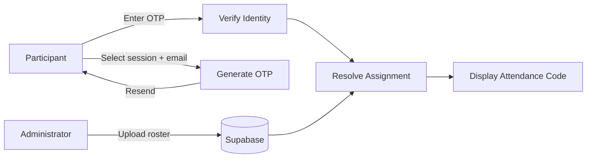
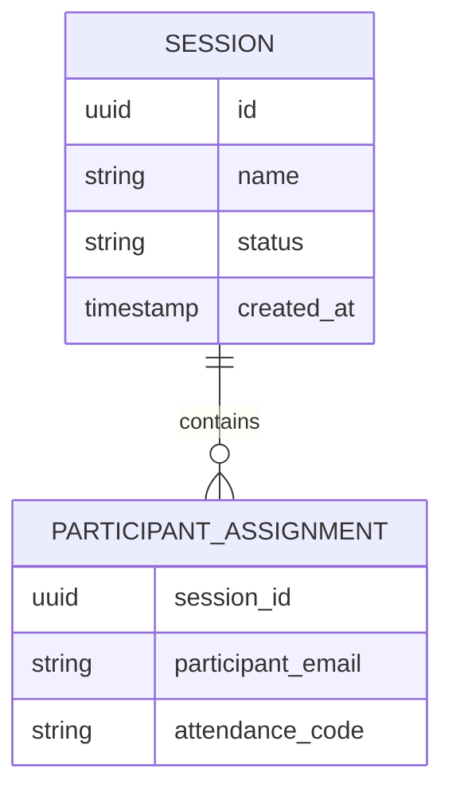

<div align="center">

# GetMyCode

**Secure, self-service attendance-code distribution**

A full-stack system that replaces manual distribution of individual attendance codes with a self-service, identity-verified retrieval flow.

[](https://nextjs.org/)
[](https://react.dev/)
[](https://www.typescriptlang.org/)
[](https://supabase.com/)
[](https://resend.com/)
[](https://vercel.com/)

</div>

---

## Overview

GetMyCode grew out of a real operational problem from the **Imo State Skill-Up Program in Nigeria**: distributing individual attendance codes to a large group of participants was slow and entirely manual, creating repeated back-and-forth between organizers and attendees.

GetMyCode turns that into a self-service flow. An administrator uploads a session roster (participant emails + assigned codes). Participants verify their identity with an email OTP and retrieve only the code assigned to them.

| Manual process | GetMyCode |
|---|---|
| Organizers distribute codes by hand | Participants retrieve their own code |
| Participants depend on organizers | Identity is verified via email OTP |
| Hard to manage at scale | Roster upload, session-scoped access |
| Codes can be lost or mis-shared | Each participant sees only their assignment |

## How It Works



Identity is always verified **before** a code is resolved — a code is never a publicly accessible resource.

## Features

- **Email OTP verification** — participants confirm ownership of their registered email via a six-digit one-time code.
- **Session-scoped codes** — each attendance code is tied to a specific session, not globally accessible.
- **Admin dashboard** — create sessions and upload participant rosters.
- **Transactional email** — OTP delivery handled through Resend.
- **Persistent storage** — sessions and assignments stored in Supabase/PostgreSQL.

## Tech Stack

| Layer | Technology |
|---|---|
| Framework | Next.js 15 |
| UI | React 18, Tailwind CSS |
| Language | TypeScript |
| Database | Supabase (PostgreSQL) |
| Email | Resend (OTP delivery) |
| Deployment | Vercel |
| Linting | ESLint |

## Data Model



A participant can hold different code assignments across different sessions, since each assignment is scoped to a session rather than treated as a global identity-to-code mapping.

## Project Structure

```
GetMyCode/
├── app/                # Application routes (incl. admin)
├── components/         # Reusable UI components
├── lib/supabase/       # Database clients and utilities
├── supabase/           # Database config and migrations
├── public/             # Static assets
├── next.config.ts
├── tailwind.config.ts
└── package.json
```

## Security Model

- **Identity before retrieval** — participants must complete OTP verification before any code is resolved.
- **Server-side secrets** — privileged keys are never exposed to the client.

```env
# Server-only
SUPABASE_SERVICE_ROLE_KEY=
RESEND_API_KEY=
ADMIN_PASSWORD=

# Public (browser-safe)
NEXT_PUBLIC_SUPABASE_URL=
NEXT_PUBLIC_SUPABASE_ANON_KEY=
```

## Getting Started

**Prerequisites:** Node.js, npm, a Supabase project, a Resend account.

```bash
git clone https://github.com/Daniel-Sunday/GetMyCode.git
cd GetMyCode
npm install
```

Create a `.env.local` file with the variables listed above, then start the dev server:

```bash
npm run dev
```

Visit [http://localhost:3000](http://localhost:3000).

## Scripts

| Command | Description |
|---|---|
| `npm run dev` | Start the development server |
| `npm run build` | Create a production build |
| `npm run start` | Start the production server |
| `npm run lint` | Run ESLint |

## Roadmap

- [ ] OTP expiration and retry limits, rate limiting
- [ ] Stronger administrator authentication
- [ ] Automated testing (unit, integration, E2E) and CI
- [ ] Multi-administrator and multi-program support
- [ ] Session analytics and attendance history

## Status

Working full-stack application implementing the full flow: roster upload → session selection → OTP verification → code retrieval. Hardening (auth, testing, rate limiting) is the next stage before wider-scale use.

## Author

**Daniel Sunday**
Building software around real operational problems, with a focus on full-stack engineering and practical product development.
